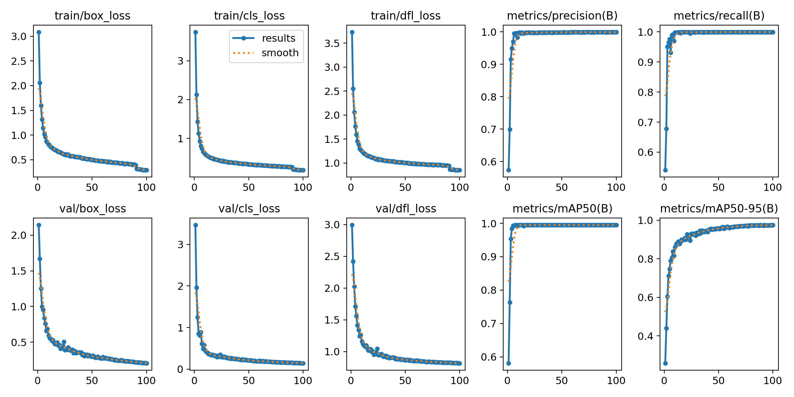
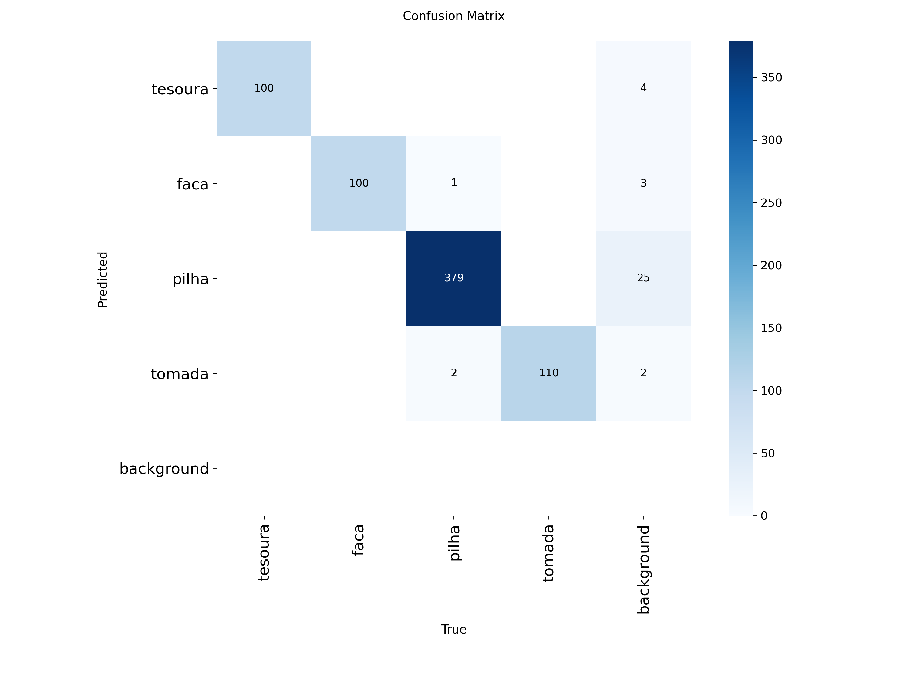

# ChildSafe Vision

Sistema de detecção de objetos domésticos potencialmente perigosos para crianças, treinado exclusivamente com imagens sintéticas geradas no Blender.

O projeto apresenta um pipeline completo de visão computacional: preparação de cenas 3D, geração automática de imagens, criação de anotações no formato YOLO, organização e validação do dataset, treinamento do YOLOv8n e avaliação em dados sintéticos e em uma imagem externa.

## Objetivo

O ChildSafe Vision foi desenvolvido como uma prova de conceito para detectar quatro objetos comuns em ambientes domésticos:

| ID | Classe |
|---:|---|
| 0 | Tesoura |
| 1 | Faca |
| 2 | Pilha |
| 3 | Tomada |

O sistema apenas localiza e classifica os objetos. Ele não detecta crianças, não mede distância real e não substitui supervisão ou medidas de segurança doméstica.

## Resultado da demonstração

Na demonstração externa, o modelo identificou:

- 3 pilhas;
- 1 tomada;
- 4 objetos detectados no total.

A inferência foi executada na imagem original e em versões rotacionadas em 90° e 270°. As caixas foram convertidas para as coordenadas originais e as detecções repetidas foram removidas por Non-Maximum Suppression (NMS).

<p align="center">
  
</p>

## Pipeline do projeto

```text
Modelos 3D e objetos procedurais
            ↓
Cenas e scripts no Blender 2.83
            ↓
Renderização de imagens sintéticas
            ↓
Anotações automáticas no formato YOLO
            ↓
Validação e divisão do dataset
            ↓
Treinamento do YOLOv8n no Google Colab
            ↓
Avaliação sintética e demonstração externa
```

## Dataset sintético

As imagens foram renderizadas no Blender 2.83 com o Eevee, em resolução de 640 × 640 pixels.

| Classe | Imagens |
|---|---:|
| Tesoura | 1.000 |
| Faca | 1.000 |
| Pilha | 1.000 |
| Tomada | 1.100 |
| **Total** | **4.100** |

A classe pilha possui várias instâncias por imagem. Por isso, o dataset contém 6.788 caixas delimitadoras, embora tenha 4.100 imagens.

### Divisão final

| Divisão | Imagens | Labels | Instâncias |
|---|---:|---:|---:|
| Treinamento | 3.280 | 3.280 | 5.422 |
| Validação | 410 | 410 | 674 |
| Teste | 410 | 410 | 692 |
| **Total** | **4.100** | **4.100** | **6.788** |

Proporção utilizada:

```text
80% treinamento
10% validação
10% teste
```

O dataset foi verificado quanto a:

- correspondência entre imagens e labels;
- labels não vazios;
- formato YOLO com cinco campos;
- classes entre 0 e 3;
- coordenadas normalizadas entre 0 e 1;
- largura e altura maiores que zero;
- ausência de nomes repetidos entre train, val e test.

### Dataset completo

O dataset completo possui aproximadamente 1,25 GB e deve ser disponibilizado externamente.

**Link para download:** `ADICIONAR_LINK_PUBLICO_DO_DATASET`

Antes da entrega, substitua a linha acima pelo link público do arquivo `dataset_final.zip` e teste o acesso em uma janela anônima.

## Geração no Blender

Os scripts realizam, conforme a classe:

- importação ou construção dos objetos;
- preparação de mesa, parede ou fundo;
- criação e ajuste de materiais;
- posicionamento da câmera;
- variação de iluminação;
- alteração de posição, rotação, escala e distância;
- validação do enquadramento;
- renderização da imagem;
- projeção da caixa 3D no plano da câmera;
- gravação da anotação YOLO.

O formato das anotações é:

```text
classe x_centro y_centro largura altura
```

As coordenadas e dimensões são normalizadas entre 0 e 1.

### Tesoura

A tesoura utiliza um modelo 3D externo. A geração foi dividida em três lotes, com mudanças de iluminação, fundo e aparência do cabo.

### Faca

A faca foi a classe com mais tentativas. Foram utilizados três grupos principais de modelos:

- boning knife;
- butter knife;
- Kitchen Knife.

O conjunto final possui:

```text
400 imagens de boning knife
200 imagens de butter knife
400 imagens de Kitchen Knife
```

As diferentes versões dos scripts foram preservadas porque mostram as correções de escala, enquadramento, iluminação e visibilidade do cabo e da lâmina.

### Pilha

A pilha foi construída proceduralmente no Blender com formas cilíndricas e materiais simples. As cenas possuem de uma a seis unidades, cada uma com sua própria caixa delimitadora.

Essa classe exigiu mais tempo de geração porque cada imagem podia reunir vários objetos, várias transformações e várias anotações.

### Tomada

A tomada americana também foi construída proceduralmente. A geometria foi formada por primitivas do Blender sobre uma parede, com variações de posição, iluminação e distância da câmera.

## Estrutura do repositório

```text
fastcamp-projeto-final-visao-computacional/
├── blender/
│   ├── assets/
│   ├── cenas/
│   └── scripts/
│       ├── tesoura/
│       ├── faca/
│       ├── pilha/
│       ├── tomada/
│       └── README.md
├── dataset_final/
│   ├── data.yaml
│   ├── classes.txt
│   ├── resumo_dataset.txt
│   └── exemplos/
├── notebooks/
│   └── ChildSafe_Vision_Projeto_Final.ipynb
├── modelo/
│   └── best_100_epocas.pt
├── resultados/
│   ├── results.png
│   ├── confusion_matrix.png
│   ├── confusion_matrix_normalized.png
│   ├── BoxF1_curve.png
│   ├── childsafe_resultado_final.jpg
│   ├── deteccoes.csv
│   └── metricas_finais.json
└── README.md
```

Os nomes podem variar ligeiramente conforme a organização final do repositório.

## Treinamento

O treinamento foi realizado no Google Colab com uma GPU Tesla T4.

| Configuração | Valor |
|---|---|
| Modelo | YOLOv8n |
| Arquitetura | `yolov8n.yaml` |
| Pesos pré-treinados | Não |
| Inicialização | Pesos aleatórios |
| Épocas | 100 |
| Resolução | 640 × 640 |
| Batch | 16 |
| Paciência | 20 |
| Workers | 2 |
| Semente | 42 |

O modelo possui aproximadamente 3.157.200 parâmetros e 8,9 GFLOPs.

Como a arquitetura foi criada a partir de `yolov8n.yaml`, o treinamento foi feito exclusivamente com os dados sintéticos deste projeto.

## Métricas no conjunto sintético de teste

A avaliação foi feita em 410 imagens e 692 instâncias.

| Métrica | Resultado |
|---|---:|
| Precisão | 0,999 |
| Recall | 1,000 |
| mAP@50 | 0,995 |
| mAP@50-95 | 0,978 |

### Resultado por classe

| Classe | Instâncias | Precisão | Recall | mAP@50 | mAP@50-95 |
|---|---:|---:|---:|---:|---:|
| Tesoura | 100 | 0,998 | 1,000 | 0,995 | 0,995 |
| Faca | 100 | 0,999 | 1,000 | 0,995 | 0,985 |
| Pilha | 382 | 1,000 | 1,000 | 0,995 | 0,937 |
| Tomada | 110 | 0,999 | 1,000 | 0,995 | 0,995 |

A pilha apresentou o menor mAP@50-95. Essa classe reúne mais instâncias, objetos menores e diferentes orientações.

<p align="center">
  
</p>

<p align="center">
  
</p>

## Domain gap

O desempenho quase perfeito no teste sintético não representa garantia de desempenho igual em imagens reais.

Na demonstração externa, o modelo foi sensível a:

- diferenças de textura;
- modelos de pilha visualmente distintos;
- orientação dos objetos;
- distância e escala;
- iluminação;
- fundos domésticos mais complexos.

A demonstração funcionou melhor quando as pilhas externas apresentavam corpo preto, parte superior cobre e formato próximo ao utilizado no dataset.

Possíveis melhorias:

- adicionar mais modelos 3D por classe;
- aumentar a variedade de materiais e texturas;
- incluir novos ambientes e fundos;
- gerar mais oclusões e escalas;
- variar com maior intensidade a iluminação;
- avaliar o modelo em mais fotografias externas;
- usar adaptação de domínio;
- testar pré-treinamento sintético seguido de ajuste com dados reais.

## Como usar

### 1. Clonar o repositório

```bash
git clone https://github.com/SEU_USUARIO/fastcamp-projeto-final-visao-computacional.git
cd fastcamp-projeto-final-visao-computacional
```

Substitua `SEU_USUARIO` pelo nome correto da conta no GitHub.

### 2. Treinamento e avaliação

Abra o notebook:

```text
notebooks/ChildSafe_Vision_Projeto_Final.ipynb
```

A execução foi preparada para o Google Colab. O notebook contém:

- configuração do ambiente;
- acesso e extração do dataset;
- validação;
- visualização das anotações;
- treinamento;
- avaliação;
- gráficos;
- inferência externa;
- análise do domain gap;
- organização dos artefatos.

### 3. Geração de novas imagens

Use o Blender 2.83.

Os scripts estão em:

```text
blender/scripts/
```

As cenas estão em:

```text
blender/cenas/
```

Antes de executar um script, revise:

- caminho do ativo 3D;
- pasta de saída;
- intervalo inicial e final;
- quantidade de imagens;
- semente;
- versão da cena.

Alguns scripts mantêm os caminhos absolutos usados durante o desenvolvimento e precisam ser adaptados ao computador atual.

Exemplo de execução em modo background no Windows:

```powershell
"C:\Program Files\Blender Foundation\Blender 2.83\blender.exe" `
  -b "CAMINHO_DA_CENA.blend" `
  -P "CAMINHO_DO_SCRIPT.py"
```

## Tecnologias

- Blender 2.83;
- Python e `bpy`;
- Eevee;
- Google Colab;
- Ultralytics YOLOv8;
- PyTorch;
- OpenCV;
- Pandas;
- Matplotlib;
- Pillow;
- PyYAML.

## Créditos dos ativos 3D

Os modelos externos foram utilizados como base e adaptados no Blender quanto a escala, orientação, materiais e posicionamento.

- **Cooking Assets**, criado por **MilkAndBanana**, disponível no Poly Pizza. Pacote em domínio público (CC0):  
  https://poly.pizza/bundle/Cooking-Assets-FKGoA2lmGL

- **CC0 - Scissors - low poly PBR 3D model**, disponibilizado por **Plaggy**:  
  https://plaggy.sellfy.store/p/cc0-scissors-3d/

- **Kitchen Knife**, criado por **reelpersen**, disponível no Poly Pizza:  
  https://poly.pizza/m/PUyMKMGnCN

Pilha e tomada foram construídas proceduralmente no próprio Blender.

## Autor

**Pither Mikael Gonçalves Duarte**

Projeto final desenvolvido para demonstrar um pipeline completo de geração de dados sintéticos e treinamento de um modelo de visão computacional.

## Observações

- O modelo foi treinado exclusivamente com dados sintéticos.
- O projeto é uma prova de conceito acadêmica.
- O resultado não deve ser utilizado como único mecanismo de proteção infantil.
- O relatório técnico é entregue separadamente e não faz parte deste repositório.
